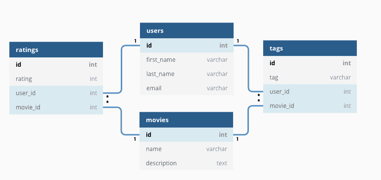

# MySQL基础
## 什么是关系型数据库？

顾名思义，关系型数据库（RDB，Relational Database）就是一种建立在关系模型的基础上的数据库。关系模型表明了数据库中所存储的数据之间的联系（一对一、一对多、多对多）。

关系型数据库中，我们的数据都被存放在了各种表中（比如用户表），表中的每一行就存放着一条数据（比如一个用户的信息）。

大部分关系型数据库都使用 SQL 来操作数据库中的数据。并且，大部分关系型数据库都支持事务的四大特性(ACID)。

有哪些常见的关系型数据库呢？

MySQL、PostgreSQL、Oracle、SQL Server、SQLite（微信本地的聊天记录的存储就是用的 SQLite） ……。

## 什么是 SQL？

SQL 是一种结构化查询语言(Structured Query Language)，专门用来与数据库打交道，目的是提供一种从数据库中读写数据的简单有效的方法。

几乎所有的主流关系数据库都支持 SQL ，适用性非常强。并且，一些非关系型数据库也兼容 SQL 或者使用的是类似于 SQL 的查询语言。

SQL 可以帮助我们：

- 新建数据库、数据表、字段；

- 在数据库中增加，删除，修改，查询数据；
- 新建视图、函数、存储过程；
- 对数据库中的数据进行简单的数据分析；
- 搭配 Hive，Spark SQL 做大数据；
- 搭配 SQLFlow 做机器学习；
- ……

## 什么是 MySQL？

MySQL 是一种关系型数据库，主要用于持久化存储我们的系统中的一些数据比如用户信息。

由于 MySQL 是开源免费并且比较成熟的数据库，因此，MySQL 被大量使用在各种系统中。任何人都可以在 GPL(General Public License) 的许可下下载并根据个性化的需要对其进行修改。MySQL 的默认端口号是3306。

## MySQL 有什么优点？

这个问题本质上是在问 MySQL 如此流行的原因。

MySQL 主要具有下面这些优点：

1. 成熟稳定，功能完善。
2. 开源免费。
3. 文档丰富，既有详细的官方文档，又有非常多优质文章可供参考学习。
4. 开箱即用，操作简单，维护成本低。
5. 兼容性好，支持常见的操作系统，支持多种开发语言。
6. 社区活跃，生态完善。
7. 事务支持优秀， InnoDB 存储引擎默认使用 REPEATABLE-READ 并不会有任何性能损失，并且，InnoDB 实现的 REPEATABLE-READ 隔离级别其实是可以解决幻读问题发生的。
8. 支持分库分表、读写分离、高可用。