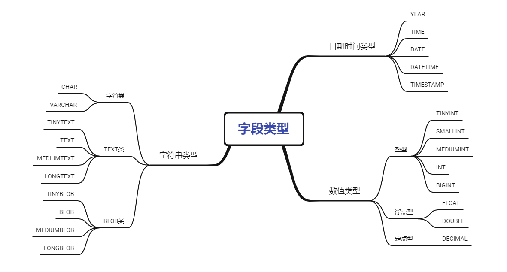

# MySQL数据类型

MySQL的数据类型简单分为三类：

## 整数类型的UNSIGNED 属性有什么用？

MySQL 中的整数类型可以使用可选的 `UNSIGNED `属性来表示不允许负值的无符号整数。使用 ~属性可以将正整数的上限提高一倍，因为它不需要存储负数值。

例如， `TINYINT UNSIGNED ` 类型的取值范围是 0 ~ 255，而普通的 `TINY` 类型的值范围是 -128 ~ 127。`INT UNSIGNED ` 类型的取值范围是 0 ~ 4,294,967,295，而普通的 `INT` 类型的值范围是 2,147,483,648 ~ 2,147,483,647。

::: tip

对于从 0 开始递增的 ID 列，使用`UNSIGNED `属性可以非常适合，因为不允许负值并且可以拥有更大的上限范围，提供了更多的 ID 值可用。

:::

## CHAR和VARCHAR的区别是什么？

`CHAR` 和 `VARCHAR` 是最常用到的字符串类型，两者的主要区别在于：**`CHAR`是定长字符串，`VARCHAR`是变长字符串。**

- 长度：

  `CHAR`在存储时会在右边填充空格以达到指定的长度，检索时会去掉空格；`VARCHAR`在存储时需要使用 1 或 2 个额外字节记录字符串的长度，检索时不需要处理。

- 适用场景：

  CHAR更适合存储长度较短或者长度都差不多的字符串，例如 Bcrypt 算法、MD5 算法加密后的密码、身份证号码。VARCHAR类型适合存储长度不确定或者差异较大的字符串，例如用户昵称、文章标题等。

- 最大值：

  CHAR(M) 和 VARCHAR(M) 的 M 都代表能够保存的字符数的最大值，无论是字母、数字还是中文，每个都只占用一个字符。

## VARCHAR(100)和 VARCHAR(10)的区别是什么？

先举个例子：如果要存储`'hello12345'`这个字符串，使用`VARCHAR(10)`和`VARCHAR(100)`存储，占用磁盘空间是一样的么？

答案是：占用磁盘的存储空间是一样的。

**既然存储时磁盘占用空间一样，还有什么其他的区别吗？**

虽然使用`VARCHAR(100)`和`VARCHAR(10)`存储`'hello12345'`字符串占用的磁盘空间一样，但是消耗的内存不一样，更长的列消耗的内存会更多。因为MySQL通常会分配固定大小的内存块来保存内部值。尤其是使用临时表进行排序会操作时，会消耗更多的内存。在使用磁盘进行排序时，也是一样。

所以此时`VARCHAR(100)` ***会消耗更多的内存。***

**VARCHAR(10)和VARCHAR(100)的优劣势是什么？**

因为涉及到文件排序或者基于磁盘的临时表时，更长的列会消耗更多的内存，所以在使用使用时，我们不能太过浪费内存空间，还是需要评估实际使用的长度来设置字符的长度。***推荐冗余10%的长度***（因业务而异）。

所使用VARCHAR(10)会更加***节约内存空间***，但是实际业务中字符长度一旦超过10就需要更改表结构，在表数据量特别大时，***不易拓展***。

而这时使用更长的列：VARCHAR(100)无需更改表结构，***业务拓展性更好***。

## DECIMAL 和 FLOAT/DOUBLE 的区别是什么？

DECIMAL 和 FLOAT 的区别是：**DECIMAL 是定点数，FLOAT/DOUBLE 是浮点数。DECIMAL 可以存储精确的小数值，FLOAT/DOUBLE 只能存储近似的小数值。**

DECIMAL 用于存储具有精度要求的小数，例如与货币相关的数据，可以避免浮点数带来的精度损失。在 Java 中，MySQL 的 DECIMAL 类型对应的是 Java 类 `java.math.BigDecimal`

## 为什么不推荐使用 TEXT 和 BLOB？

TEXT 类型类似于 CHAR（0-255 字节）和 VARCHAR（0-65,535 字节），但可以存储更长的字符串，即长文本数据，例如博客内容。

| 类型       | 可存储大小           | 用途           |
| ---------- | -------------------- | -------------- |
| TINYTEXT   | 0-255 字节           | 一般文本字符串 |
| TEXT       | 0-65,535 字节        | 长文本字符串   |
| MEDIUMTEXT | 0-16,772,150 字节    | 较大文本数据   |
| LONGTEXT   | 0-4,294,967,295 字节 | 极大文本数据   |

BLOB 类型主要用于存储二进制大对象，例如图片、音视频等文件。

| 类型       | 可存储大小 | 用途                     |
| ---------- | ---------- | ------------------------ |
| TINYBLOB   | 0-255 字节 | 短文本二进制字符串       |
| BLOB       | 0-65KB     | 二进制字符串             |
| MEDIUMBLOB | 0-16MB     | 二进制形式的长文本数据   |
| LONGBLOB   | 0-4GB      | 二进制形式的极大文本数据 |

在日常开发中，很少使用 TEXT 类型，但偶尔会用到，而 BLOB 类型则基本不常用。如果预期长度范围可以通过 VARCHAR 来满足，建议避免使用 TEXT。

数据库规范通常不推荐使用 BLOB 和 TEXT 类型，这两种类型具有一些缺点和限制，例如：

- 不能有默认值。
- 在使用临时表时无法使用内存临时表，只能在磁盘上创建临时表（《高性能 MySQL》书中有提到）。
- 检索效率较低。
- 不能直接创建索引，需要指定前缀长度。
- 可能会消耗大量的网络和 IO 带宽。
- 可能导致表上的 DML 操作变慢。
- ……

## DATETIME 和 TIMESTAMP 的区别是什么？

DATETIME 类型没有时区信息，TIMESTAMP 和时区有关。

TIMESTAMP 只需要使用 4 个字节的存储空间，但是 DATETIME 需要耗费 8 个字节的存储空间。但是，这样同样造成了一个问题，Timestamp 表示的时间范围更小。

- DATETIME：1000-01-01 00:00:00 ~ 9999-12-31 23:59:59
- Timestamp：1970-01-01 00:00:01 ~ 2037-12-31 23:59:59

关于两者的详细对比，请参考我写的[MySQL 时间类型数据存储建议](https://javaguide.cn/database/mysql/some-thoughts-on-database-storage-time.html)。

## NULL 和 '' 的区别是什么？

`NULL` 跟 `''`(空字符串)是两个完全不一样的值，区别如下：

- `NULL` 代表一个不确定的值,就算是两个 `NULL`,它俩也不一定相等。例如，`SELECT NULL=NULL`的结果为 false，但是在我们使用`DISTINCT`,`GROUP BY`,`ORDER BY`时,`NULL`又被认为是相等的。
- `''`的长度是 0，是不占用空间的，而`NULL` 是需要占用空间的。
- `NULL` 会影响聚合函数的结果。例如，`SUM`、`AVG`、`MIN`、`MAX` 等聚合函数会忽略 `NULL` 值。 `COUNT` 的处理方式取决于参数的类型。如果参数是 `*`(`COUNT(*)`)，则会统计所有的记录数，包括 `NULL` 值；如果参数是某个字段名(`COUNT(列名)`)，则会忽略 `NULL` 值，只统计非空值的个数。
- 查询 `NULL` 值时，必须使用 `IS NULL` 或 `IS NOT NULLl` 来判断，而不能使用 =、!=、 <、> 之类的比较运算符。而`''`是可以使用这些比较运算符的。

看了上面的介绍之后，相信你对另外一个高频面试题：“为什么 MySQL 不建议使用 `NULL` 作为列默认值？”也有了答案。

## Boolean 类型如何表示？

MySQL 中没有专门的布尔类型，而是用 TINYINT(1) 类型来表示布尔值。TINYINT(1) 类型可以存储 0 或 1，分别对应 false 或 true。
