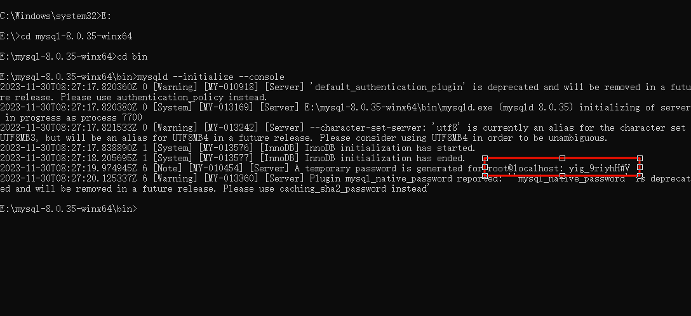
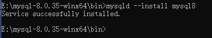

# Windows安装MySQL

## 下载

版本：`MySQL Community Server 8.0.35`

下载地址：https://dev.mysql.com/downloads/mysql/

## 配置

下载后解压到磁盘，打开解压文件夹，创建my.ini文件，并修改basedir和datadir属性

```ini
[mysqld]
#设置3306端口
port=3306
#设置mysql的安装目录
basedir=E:\mysql-8.0.35-winx64
#设置mysql数据库的数据的存放目录
datadir=E:\mysql-8.0.35-winx64\data
#允许最大连接数
max_connections=200
#允许连接失败的次数。这是为了防止有人从该主机试图攻击数据库系统
max_connect_errors=10
#服务端使用的字符集默认为UTF8
character-set-server=utf8
#创建新表时将使用的默认存储引擎
default-storage-engine=INNODB
#默认使用“mysql_native_password”插件认证
default_authentication_plugin=mysql_native_password
 
[mysql]
#设置mysql客户端默认字符集
default-character-set=utf8
[client]
#设置mysql客户端连接服务端时默认使用的端口
port=3306
default-character-set=utf8
```

## 安装

以管理员身份打开命令行，切换到安装MySQL的目录下，再切换到bin目录下

### 执行初始化命令

```shell
mysqld --initialize --console
```

鼠标选中密码，ctr+c复制密码。



### 安装mysql服务

```shell
mysqld --install 你的服务名
```



### 登录mysql

输入命令登录

```shell
mysql -u root -p密码
```

### 修改密码

```shell
ALTER USER root@localhost IDENTIFIED BY '新密码';
```

