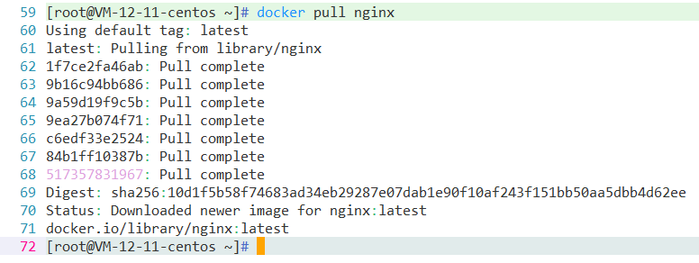
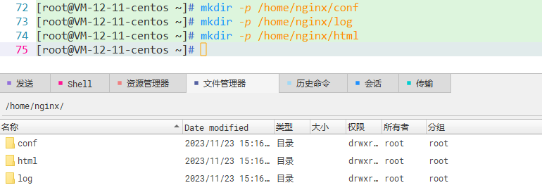
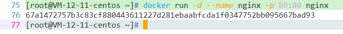
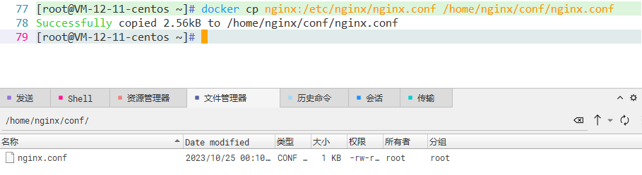
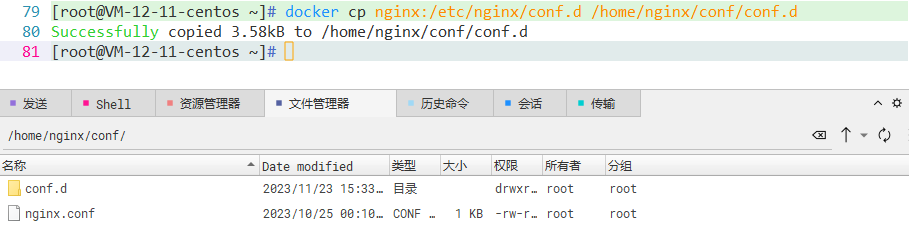
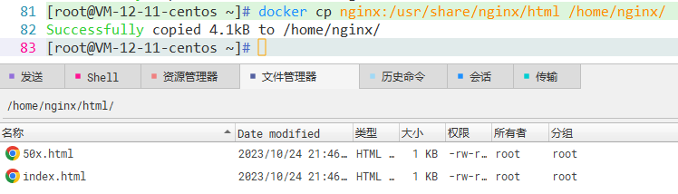
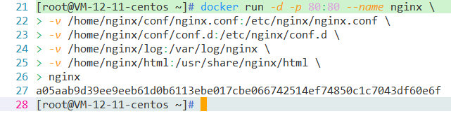
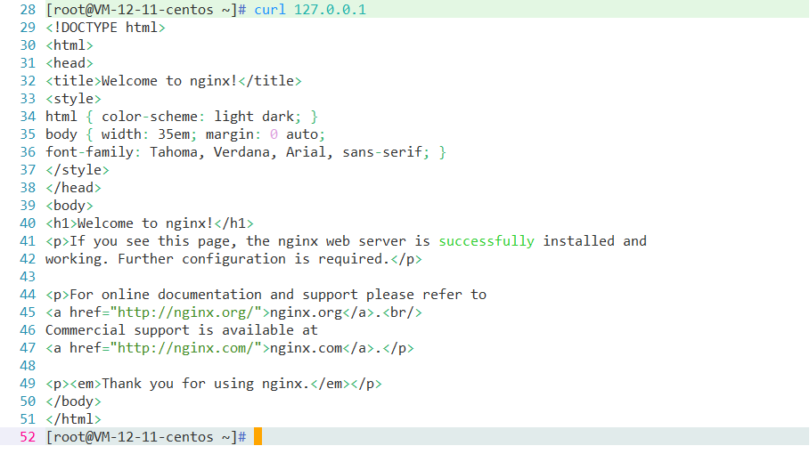

# Docker 安装 Nginx

## 1 拉取镜像

```shell
docker pull nginx
```



## 2 创建Nginx配置文件 

启动前需要先创建Nginx外部挂载的配置文件（ /home/nginx/conf/nginx.conf）。之所以要先创建 , 是因为Nginx本身容器只存在/etc/nginx 目录 , 本身就不创建 nginx.conf 文件。当宿主机和容器都不存在 nginx.conf 文件时，执行启动命令的时候 docker会将nginx.conf 作为目录创建 , 这并不是我们想要的结果。

```shell
mkdir -p /home/nginx/conf
mkdir -p /home/nginx/log
mkdir -p /home/nginx/html
```



## 3 复制配置文件

将容器中的nginx.conf文件、conf.d文件夹和html文件夹复制到宿主机

①运行Nginx容器生成容器内的配置文件

```shell
docker run -d --name nginx -p 80:80 nginx
```



②将容器nginx.conf文件复制到宿主机

```shell
docker cp nginx:/etc/nginx/nginx.conf /home/nginx/conf/nginx.conf
```



③将容器conf.d文件夹下内容复制到宿主机

```shell
docker cp nginx:/etc/nginx/conf.d /home/nginx/conf/conf.d
```



④将容器中的html文件夹复制到宿主机

```shell
docker cp nginx:/usr/share/nginx/html /home/nginx/
```



## 4 创建Nginx容器并运行

①停止并删除运行的Nginx容器

```shell
docker rm -f nginx
```

②重新运行Nginx容器，并挂载宿主机配置目录

```shell
docker run -d -p 80:80 --name nginx \
-v /home/nginx/conf/nginx.conf:/etc/nginx/nginx.conf \
-v /home/nginx/conf/conf.d:/etc/nginx/conf.d \
-v /home/nginx/log:/var/log/nginx \
-v /home/nginx/html:/usr/share/nginx/html \
nginx
```



③测试运行

```
curl 127.0.0.1
```


