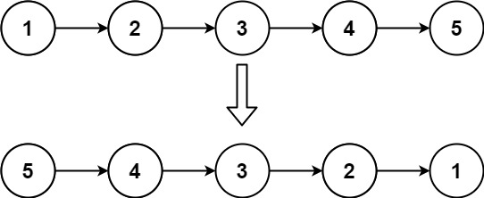

# 反转链表

给你单链表的头节点 `head` ，请你反转链表，并返回反转后的链表。

示例1：



```
输入：head = [1,2,3,4,5]
输出：[5,4,3,2,1]
```

示例2：


```
输入：head = [1,2]
输出：[2,1]
```

示例3：

```
输入：head = []
输出：[]
```

**提示：**

- 链表中节点的数目范围是 `[0, 5000]`
- `-5000 <= Node.val <= 5000`


## 方法一：迭代(双指针)

在遍历链表时，将当前节点的 `next` 指针改为指向前一个节点。由于节点没有引用其前一个节点，因此必须事先存储其前一个节点。在更改引用之前，还需要存储后一个节点。最后返回新的头引用。

```java
class Solution {
    public ListNode reverseList(ListNode head) {
        // 当前节点
        ListNode curr = head;
        // 上一个节点
        ListNode prev = null;
        // 当前节点为空时结束迭代
        while (curr != null) {
            // 用一个临时节点保存当前节点的下一个节点
            ListNode temp = curr.next;
            // 当前节点指向上一个节点
            curr.next = prev;
            // 移动上一个节点到当前节点
            prev = curr;
            // 移动当前节点到下一个节点
            curr = temp;
        }
        return prev;
    }
}
```

**复杂度分析**

- 时间复杂度：O(n)，其中 n 是链表的长度。需要遍历链表一次。
- 空间复杂度：O(1)， 变量 `prev` 和 `curr` 使用常数大小额外空间。

## 方法二：递归

考虑使用递归法遍历链表，当越过尾节点后终止递归，在回溯时修改各节点的 next 引用指向。

- reverse(curr, prev) 递归函数：

  1. 终止条件：当 curr 为空，则返回尾节点 prev （即反转链表的头节点）；
  2. 递归后继节点，记录返回值（即反转链表的头节点）为 temp；
  3. 修改当前节点 curr 引用指向前驱节点 prev ；
  4. 返回反转链表的头节点 temp；

- reverseList(head) 函数：
  1. 调用并返回 reverse(head, null) 。传入 null 是因为反转链表后， head 节点指向 prev（null）；

```java
class Solution {
    public ListNode reverseList(ListNode head) {
        // 递归函数
        return reverse(head, null);
    }

    public ListNode reverse(ListNode curr, ListNode prev){
        // 当前节点为空时结束递归
        if (curr == null) return prev;
        // 临时节点存储当前节点的下一个节点
        ListNode temp = curr.next;
        // 当前节点指向上一个节点
        curr.next = prev;
        // 递归
        return reverse(temp, curr);
    }
}
```


代码随想录讲解：https://www.bilibili.com/video/BV1nB4y1i7eL

力扣题解：https://leetcode.cn/problems/reverse-linked-list/solutions/2361282/206-fan-zhuan-lian-biao-shuang-zhi-zhen-r1jel/
