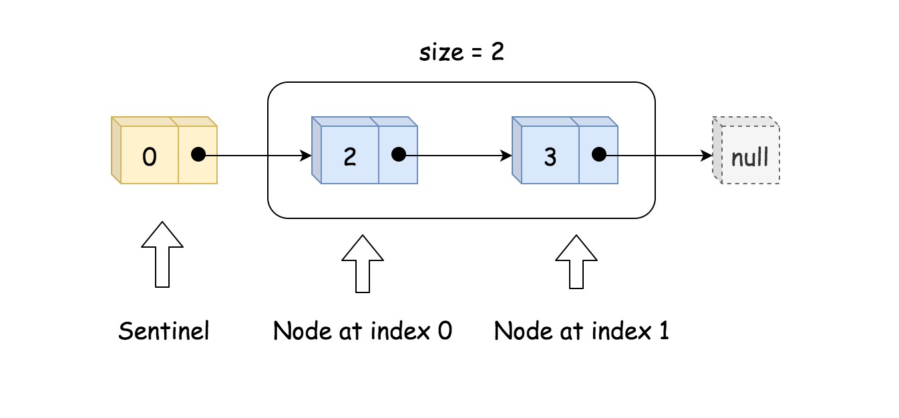
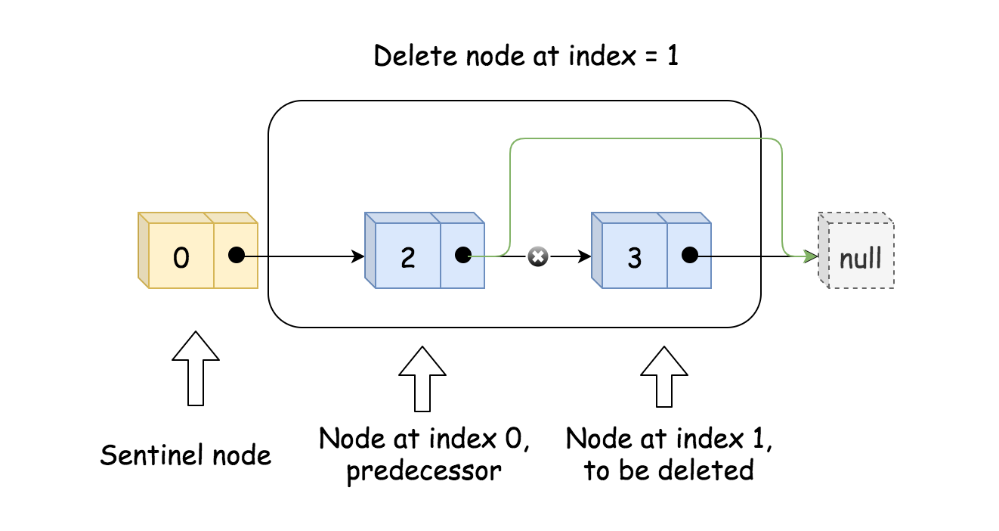

# 设计链表

你可以选择使用单链表或者双链表，设计并实现自己的链表。

单链表中的节点应该具备两个属性：`val` 和 `next` 。`val` 是当前节点的值，`next` 是指向下一个节点的指针/引用。

如果是双向链表，则还需要属性 `prev` 以指示链表中的上一个节点。假设链表中的所有节点下标从 **0** 开始。

实现 `MyLinkedList` 类：

- `MyLinkedList()` 初始化 `MyLinkedList` 对象。
- `int get(int index)` 获取链表中下标为 `index` 的节点的值。如果下标无效，则返回 `-1` 。
- `void addAtHead(int val)` 将一个值为 `val` 的节点插入到链表中第一个元素之前。在插入完成后，新节点会成为链表的第一个节点。
- `void addAtTail(int val)` 将一个值为 `val` 的节点追加到链表中作为链表的最后一个元素。
- `void addAtIndex(int index, int val)` 将一个值为 `val` 的节点插入到链表中下标为 `index` 的节点之前。如果 `index` 等于链表的长度，那么该节点会被追加到链表的末尾。如果 `index` 比长度更大，该节点将 **不会插入** 到链表中。
- `void deleteAtIndex(int index)` 如果下标有效，则删除链表中下标为 `index` 的节点。

 

**示例：**

```
输入
["MyLinkedList", "addAtHead", "addAtTail", "addAtIndex", "get", "deleteAtIndex", "get"]
[[], [1], [3], [1, 2], [1], [1], [1]]
输出
[null, null, null, null, 2, null, 3]

解释
MyLinkedList myLinkedList = new MyLinkedList();
myLinkedList.addAtHead(1);
myLinkedList.addAtTail(3);
myLinkedList.addAtIndex(1, 2);    // 链表变为 1->2->3
myLinkedList.get(1);              // 返回 2
myLinkedList.deleteAtIndex(1);    // 现在，链表变为 1->3
myLinkedList.get(1);              // 返回 3
```

 

**提示：**

- `0 <= index, val <= 1000`
- 请不要使用内置的 LinkedList 库。
- 调用 `get`、`addAtHead`、`addAtTail`、`addAtIndex` 和 `deleteAtIndex` 的次数不超过 `2000` 。


## 方法一：单向链表

实现单向链表，即每个节点仅存储本身的值和后继节点。除此之外，我们还需要一个哨兵（sentinel）节点作为头节点，和一个 size 参数保存有效节点数。如下图所示。



初始化时，只需创建头节点 head 和 size 即可。

实现 get(index) 时，先判断有效性，再通过循环来找到对应的节点的值。如下图所示。


实现 addAtIndex(index, val) 时，如果 index 是有效值，则需要找到原来下标为 index 的节点的前驱节点 pred，并创建新节点 to_add，将to_add 的后继节点设为 pred 的后继节点，将 pred 的后继节点更新为 to_add，这样就将 to_add 插入到了链表中。最后需要更新 size。这样的操作对于 index=0 也成立，如以下两张图所示。


实现 addAtHead(val) 和 addAtTail(val) 时，可以借助 addAtIndex(index, val) 来实现。

实现 deleteAtIndex(index) ，先判断参数有效性。然后找到下标为 index 的节点的前驱节点 pred，通过将 pred 的后继节点更新为 pred 的后继节点的后继节点，来达到删除节点的效果。同时也要更新 size。如下图所示。




**代码**

```sql
class ListNode{
    int val;
    ListNode next;
    public ListNode(int val) {
        this.val = val;
    }
}
class MyLinkedList {
    int size;
    // 哨兵节点
    ListNode sentinel;

    public MyLinkedList() {
        size = 0;
        sentinel = new ListNode(0);
    }
    
    public int get(int index) {
        // 判断索引合法性
        if (index < 0 || index >= size) {
            return -1;
        }
        // 初始化遍历指针
        ListNode curr = sentinel;
        // 移动指针找到索引位置
        for (int i = 0; i <= index; i++) {
            curr = curr.next;
        }
        // 返回索引位置的值
        return curr.val;
    }
    
    public void addAtHead(int val) {
        addAtIndex(0, val);
    }
    
    public void addAtTail(int val) {
        addAtIndex(size, val);
    }
    
    public void addAtIndex(int index, int val) {
        // 判断索引合法性
        if (index < 0 || index > size) {
            return;
        }
        // 初始化前驱指针
        ListNode prev = sentinel;
        // 移动前驱指针到索引位置的前驱位置
        for (int i = 0; i < index; i++) {
            prev = prev.next;
        }
        // 初始化添加节点
        ListNode toAdd = new ListNode(val);
        // 添加节点
        toAdd.next = prev.next;
        prev.next = toAdd;
        // 长度加一
        size++;
    }
    
    public void deleteAtIndex(int index) {
        // 判断索引合法性
        if (index < 0 || index >= size) {
            return;
        }
        // 初始化前驱指针
        ListNode prev = sentinel;
        // 移动前驱指针到索引位置的前驱位置
        for (int i = 0; i < index; i++) {
            prev = prev.next;
        }
        // 删除节点
        prev.next = prev.next.next;
        // 长度加一
        size--;
    }
}
```

**复杂度分析**

- 时间复杂度：初始化消耗 O(1) ，get消耗 O(index) ， addAtHead 消耗 O(1) ， addAtTail 消耗 O(n) ，其中 n 为链表长度，即 addAtHead ， addAtTail 和 addAtIndex 已调用之和， addAtIndex 消耗 O(index)。
- 空间复杂度：所有函数的单次调用空间复杂度均为O(1)，总体空间复杂度为 O(n)，其中 n 为 addAtHead ，addAtTail 和 addAtIndex 调用次数之和。

## 方法二：双向链表

 