# Kafka概述

## 1 Kafka定义

Kafka传统定义：Kafka是一个**分布式**的基于**发布/订阅模式**的**消息队列**(Message Queue)，主要应用于大数据实时处理领域。

发布/订阅：消息的发布者不会将消息直接发送给特定的订阅者，而是**将发布的消息分为不同的类别**，订阅者**只接收感兴趣的消息**。

Kafka最新定义：Kafka是一个开源的**分布式事件流平台**（Event Streaming Platform），被数千家公司用于高性能**数据管道**、**流分析**、**数据集成**和**关键任务应用**。

## 2 消息队列

目前企业中比较常见的消息队列产品主要有Kafka、ActiveMQ、RabbitMQ、RocketMQ等。在大数据场景主要采用Kafka作为消息队列。在JavaEE开发中主要采用ActiveMQ、RabbitMQ、RocketMQ。

### 2.1 传统消息队列的应用场景

传统的消息队列的主要应用场景包括：**缓冲/消峰**、**解耦**和**异步通信**。

#### 缓冲/消峰

有助于控制和优化数据流经过系统的速度，解决生产消息和消费消息的处理速度不一致的情况。

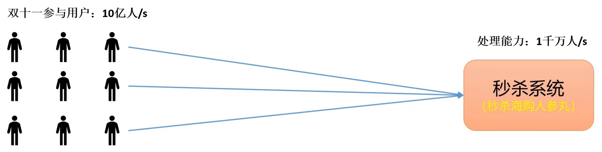

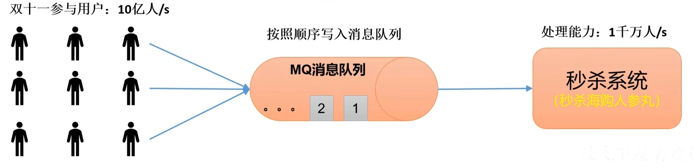

#### 解耦

允许你独立的扩展或修改两边的处理过程，只要确保它们遵守同样的接口约束。

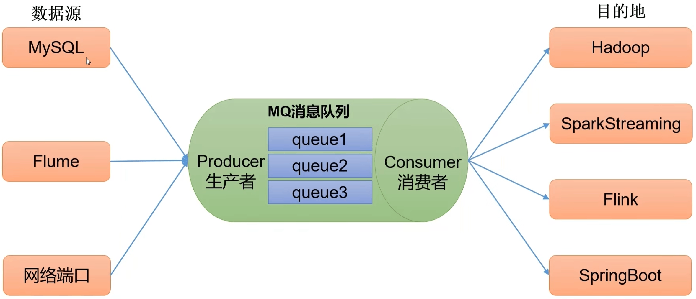

#### 异步通信

允许用户把一个消息放入队列，但并不立即处理它，然后在需要的时候再去处理它们。

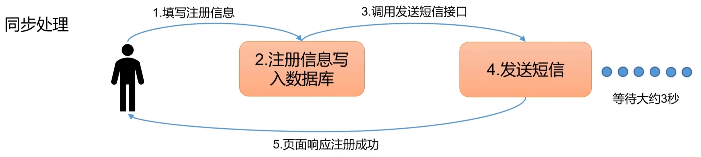

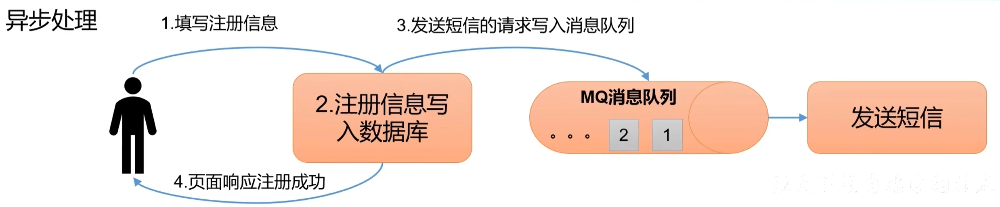

### 2.2 消息队列的两种模式

消息队列有点对点模式和发布/订阅模式。

#### 点对点模式

- 消费者主动拉取数据，消息收到后清除消息

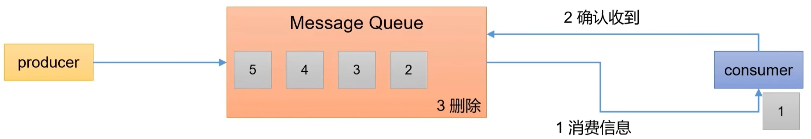

#### 发布/订阅模式

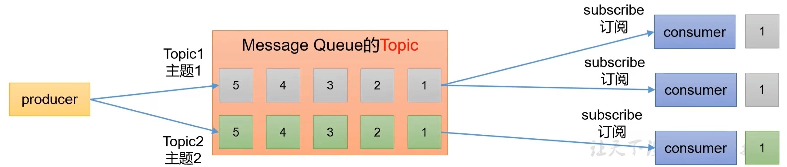

## 3 Kafka基础架构

- Producer：消息生产者，向Kafka broker发消息的客户端。
- Topic：消息源的不同分类。
- Consumer：消息消费者，向Kafka broker取消息的客户端。

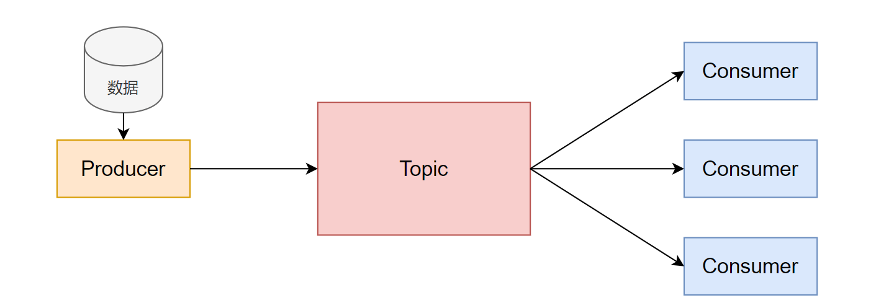

随着海量数据的到来，单实例的架构已不满足需求，为方便扩展，并提高吞吐量。

- Kafka Cluster：Kafka实例集群。
- Broker：缓存代理，Kafka集群中的一台或多台服务器统称Broker。
- Partition：Topic物理上的分区，一个Topic可以分为多个Partition，每个Partition是一个有序的队列。

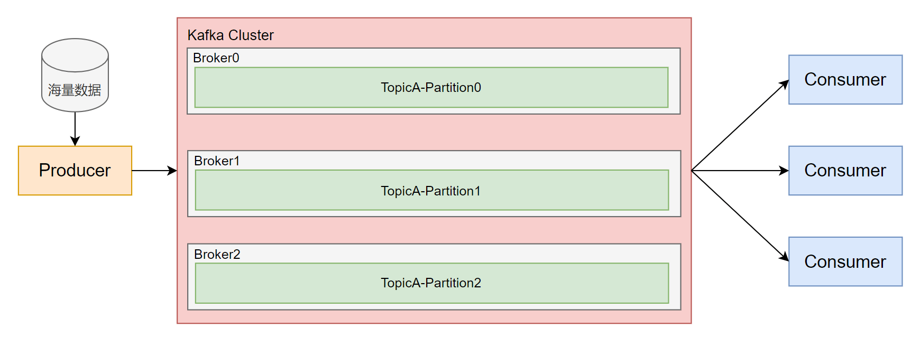

为了配合Partition分区的设计，提出了消费组的概念，组内的每个消费者并行消费。

- Group：消费者组，一个分区的数据只能由组内一个消费者来消费。

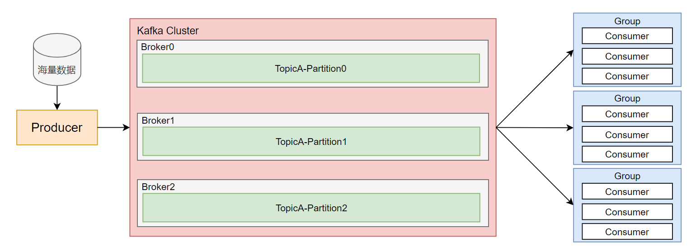

为了防止Partition分区故障，为每个Partition分区增加副本，进而提高可用性。

Leader：Kafka的读写操作，都是发生在Leader上的。Leader负责把数据同步给Follower。当Leader挂了，经过选举后，从多个Follower中选举出新的Leader。

Follower：接收Leader同步的数据。

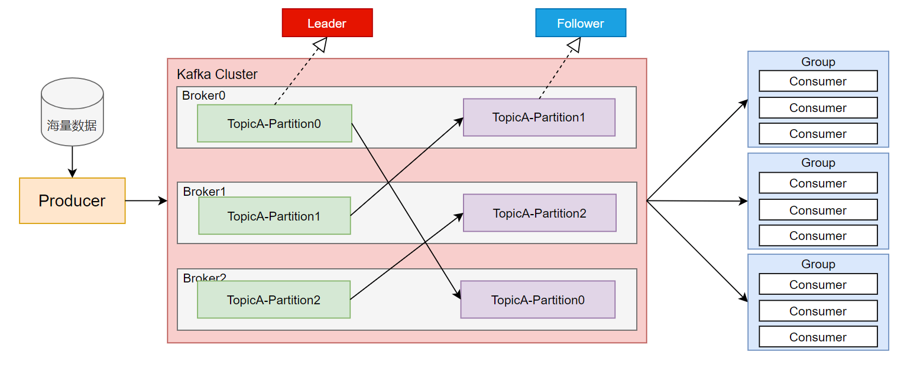
