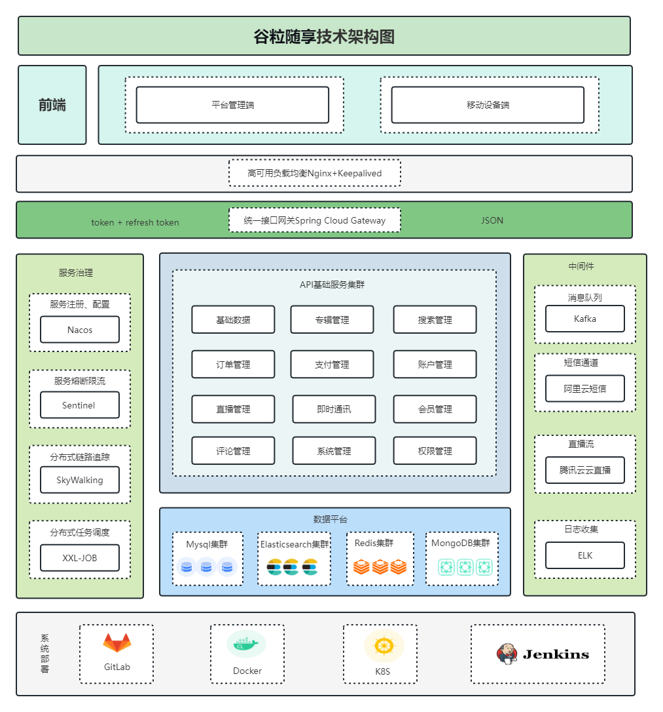

# 1 谷粒随享

## 1.1 课程前置内容

### 项目背最

随着智能手机和高速互联网的普及，人们开始寻求更便捷的方式来获取信息和娱乐。有声书的出现使得人们可以在旅途中、跑步时、做家务时等各种场景下，以更加灵活的方式享受阅读。

在过去，有声书主要是由专业的演员朗读，制作成录音带或CD。但随着数字化媒体的发展，听书软件应运而生，为用户提供了更多选择，包括自助出版的有声书和多样化的内容。

### 项目意义

1. 便捷性：听书软件使得阅读不再局限于纸质书籍，用户可以通过手机等设备在任何时间、任何地点收听有声书，节省了携带实体书的麻烦。
2. 多样化内容：听书软件提供了广泛的有声书选择，涵盖了各种类型的图书、小说、杂志、教育内容等。这样的多样性使得用户能够根据个人兴趣和需求选择内容。
3. 阅读体验：通过专业的朗读演员和音效制作，听书软件可以提供更加生动、有趣的阅读体验，有助于吸引更多读者，尤其是那些不太喜欢阅读纸质书籍的人。
4. 辅助功能：听书软件通常还具备一些辅助功能，如调整朗读速度、书签功能、字幕显示等，有助于提高可访问性，使得视力受损或其他障碍的用户也能轻松阅读。
5. 支持作家和内容创作者：听书软件为作家和内容创作者提供了另一种传播作品的渠道，有助于扩大影响力和读者群。
6. 学习工具：听书软件也可以用作学习工具，提供学术教材、外语学习材料等，帮助用户在学习过程中更好地理解和吸收知识。

总的来说，听书软件的开发推动了阅读体验的数字化和个性化，为用户提供了更加便捷、多样化的阅读方式，也促进了作家和内容创作者的创作和传播。

### 核心技术

Spring Boot：简化Spring应用的初始搭建以及开发过程

Spring Cloud：基于Spring Boot实现的云原生应用开发工具

MyBatis-Plus：持久层框架，也依赖Mybatis

Redis：内存做缓存

Redisson：基于Redis的Java驻内存数据网格 - 框架；操作Redis的框架

MongoDB：分布式文件存储的数据库

Kafka：消息中间件；大型分布式项目是标配；分布式事务最终一致性

ElasticSearch+Kibana+Logstash/Filebeat：全文检索服务器+可视化数据监控

ThreadPoolExecutor+CompletableFuture：线程池来实现异步操作，提高效率

xxl-Job：分布式定时任务调用中心

Knife4J/YAPI：Api接口文档工具

MinIO（私有化对象存储集群）：分布式文件存储 类似于OSS（公有）

MySQL：关系型数据库 ，shardingSphere-jdbc 进行读写分离; 分库，分表

Lombok: 实体类的中get/set 生成的jar包

natapp：内网穿透

Docker：容器化技术;  生产环境Redis（运维人员）；快速搭建环境Docker run

Git：代码管理工具；git使用，拉代码、提交、推送、合并、冲突解决

前端技术栈：

UniApp

Vue3全家桶

TypeScript

Grace-UI

Uni-UI

uniapp-axios-adapter

## 1.2 项目架构

