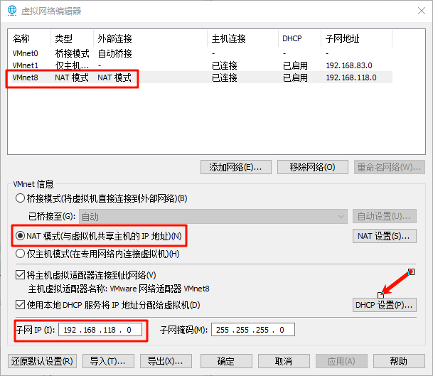
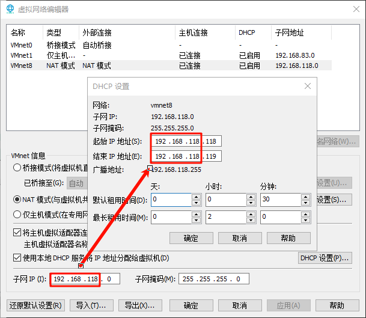
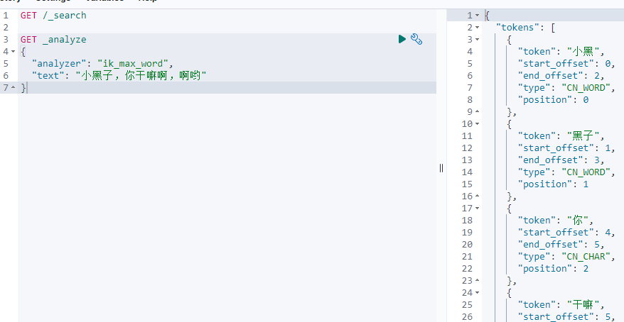

# 2 项目环境准备
## 2.1 准备linux环境

### 安装vmware虚拟机

略

### 安装centos7系统

略

### 虚拟机网路配置

编辑——>虚拟网络编辑器

①固定ip地址(nat模式)



②起始ip地址、结束ip地址、子网ip需要同一号段



同时起始ip和结束ip需要相邻，保证DHCP分配ip地址固定为起始ip

## 2.2 安装docker环境

### 为什么要用docker

docker可以带软件环境帮我们安装应用，不同的系统中docker同一种安装方式

### 基本概念

Docker是一个开源的应用容器引擎，基于go语言开发并遵循了apache2.0协议开源。Docker是在Linux容器里运行应用的开源工具，是一种轻量级的“虚拟机"。Docker 的容器技术可以在一台主机上轻松为任何应用创建一个轻量级的、可移植的、自给自足的容器。Docker的Logo设计为鲸鱼拖着许多集装箱。鲸鱼可看作为宿主机，集装箱可理解为相互隔离的容器，每个集装箱中都包含自己的应用程序。

### 常用命令

| 命令描述       | 命令                     |
| -------------- | ------------------------ |
| 启动docker     | systemctl start docker   |
| 关闭docker     | systemctl stop docker    |
| 重启docker     | systemctl restart docker |
| docker开机自启 | systemctl enable docker  |

### 安装步骤

①安装必要的一些系统工具

```shell
sudo yum install -y yum-utils device-mapper-persistent-data lvm2
```

②添加软件源信息

```shell
sudo yum-config-manager --add-repo https://mirrors.aliyun.com/docker-ce/linux/centos/docker-ce.repo
```

③修改docker仓库地址

```shell
sudo sed -i 's+download.docker.com+mirrors.aliyun.com/docker-ce+' /etc/yum.repos.d/docker-ce.repo
```

④安装docker-ce

快速生成本地的 YUM 软件包缓存

```shell
sudo yum makecache fast
```

安装docker-ce

```shell
sudo yum -y install docker-ce
```

⑤开启Docker服务

```shell
sudo service docker start
```


## 2.3 docker安装ES和Kibana

### 安装elasticsearch

1. 修改系统内核参数

   ```shell
   # 使用 Vim 编辑器打开 /etc/sysctl.conf 文件
   vim /etc/sysctl.conf
   # 将vm.max_map_count 参数设置为 262144，增加这个值可以提高系统的性能
   vm.max_map_count=262144
   # 读取 /etc/sysctl.conf 文件中的内核参数设置，并将其应用到系统中
   sudo sysctl -p
   ```

2. 加载elasticsearch容器

   ```shell
   # 创建一个名为 "elastic" 的网络
   docker network create elastic
   # 从 "elasticsearch.tar" 文件中加载镜像到docker(提前准备tar包到/usr/local/software目录下)
   cd /usr/local/software
   docker load -i elasticsearch.tar
   # 列出当前目录下的所有 ".tar" 文件，并使用 xargs 命令逐个执行 docker load -i 命令，将它们加载到docker镜像中
   ls *.tar | xargs -n 1 docker load -i
   ```

   运行elasticsearch容器

   ```shell
   docker run --name myes -p 9200:9200 -p 9300:9300 \
   --net elastic \
   --restart=always \
   -e ES_JAVA_OPTS="-Xms1g -Xmx1g" \
   -e xpack.security.enabled=false \
   -e xpack.security.enrollment.enabled=false \
   -e xpack.security.http.ssl.enabled=false \
   -e xpack.security.transport.ssl.enabled=false \
   -e node.name=es01 \
   -e cluster.name=docker-cluster \
   -e cluster.initial_master_nodes=es01 \
   -e network.host=0.0.0.0 \
   -v /usr/local/software/elasticsearch/plugins:/usr/share/elasticsearch/plugins \
   -d docker.elastic.co/elasticsearch/elasticsearch:8.5.0
   ```

   重启elasticsearch容器

   ```shell
   docker restart myes 
   ```

   命令中的 `-f` 参数表示 "follow"，即实时跟踪并显示elasticsearch容器的日志输出。

   ```shell
   docker logs -f myes
   ```

### 安装kibana

加载本地kibana镜像到docker中

```shell
docker load -i kibana.tar
```

运行kibana容器

```shell
docker run --name mykibana -p 5601:5601 \
--net elastic \
--restart=always \
-d docker.elastic.co/kibana/kibana:8.5.0
```

命令中的 `-f` 参数表示 "follow"，即实时跟踪并显示kibana容器的日志输出。

```shell
docker logs -f mykibana
```

### 安装IK分词器

- 安装

创建elasticsearch的插件，IK分词器的文件夹

```shell
mkdir -p /usr/local/software/elasticsearch/plugins/ik
```

修改/usr/local/software/elasticsearch文件夹的权限

```shell
chmod -R 777 /usr/local/software/elasticsearch
```

- 上传解压IK并删除

复制IK的zip包到elasticsearch/plugins/ik/文件夹中

```shell
 cp elasticsearch-analysis-ik-8.5.0.zip elasticsearch/plugins/ik/
```

切换目录到elasticsearch/plugins/ik/文件夹下

```shell
cd elasticsearch/plugins/ik/
```

解压IK

```shell
unzip elasticsearch-analysis-ik-8.5.0.zip
```

删除IK

```shell
rm -rf elasticsearch-analysis-ik-8.5.0.zip
```

重启elasticsearch，查看日志

```shell
# 重启elasticsearch
docker restart myes
# 实时查看elasticsearch日志
docker logs -f myes
```



## 2.4 docker安装其他软件

### 安装Redis

1. 加载镜像

   ```shell
   cd /usr/local/software
   docker load -i redis.tar
   ```

2. 创建容器（6379端口容易被黑客挖矿攻击）

   ```shell
   docker run -di --name=myredis -p 6389:6379 redis
   ```

### 安装MySQL8

1. 加载镜像

   ```shell
   docker load -i mysql8.tar
   ```

2. 创建容器

   ```shell
   docker run -d \
   -p 3316:3306 \
   -v /atguigu/mysql/master/conf:/etc/mysql/conf.d \
   -v /atguigu/mysql/master/data:/var/lib/mysql \
   -e MYSQL_ROOT_PASSWORD=123 \
   --name mysql8.0 \
   mysql:latest
   ```

### 安装Minio

1. 加载镜像

   ```shell
   docker load -i minio.tar
   ```

2. 创建容器

   ```shell
   docker run -d \
   -p 9000:9000 \
   -p 9001:9001 \
   -e "MINIO_ROOT_USER=enjoy6288" \
   -e "MINIO_ROOT_PASSWORD=enjoy6288" \
   -v /mnt/data:/data -v /mnt/config:/root/.minio \
   minio/minio server /data --console-address ":9001" 
   ```

### 安装MongoDB

1. 加载镜像

   ```shell
   docker load -i mongo.tar
   ```

2. 创建容器

   ```shell
   docker run -d --name mymongo -p 27017:27017 mongo
   ```

3. 创建用户

   ```shell
   # 进入容器
   docker exec -it mymongo mongosh
   # 使用数据库
   use admin
   # 创建用户
   db.createUser({user:'root',pwd:'123', roles:[{role:'root', db:'admin'}]})
   # 授权用户
   db.auth('root','123')
   
   db.dropUser('root')
   use tingshu
   db.createCollection("User")
   db.User.insert({name:'lisi',age:21,sex:true})
   ```

### 安装Zookeeper

1. 加载镜像

   ```shell
   docker load -i zookeeper.tar
   ```

2. 创建容器

   ```shell
   docker run -d --name zookeeper --publish 2181:2181 \
   --volume /etc/localtime:/etc/localtime \
   --restart=always \
   wurstmeister/zookeeper 
   ```

### 安装kafka

1. 加载镜像

   ```shell
   docker load -i kafka.tar
   ```

2. 创建容器

   ```shell
   docker run -d --name kafka --publish 9092:9092 \
   --link zookeeper:zookeeper \
   --env KAFKA_BROKER_ID=100 \
   --env HOST_IP=192.168.118.118 \
   --env KAFKA_ZOOKEEPER_CONNECT=zookeeper:2181 \
   --env KAFKA_ADVERTISED_HOST_NAME=192.168.118.118 \
   --env KAFKA_ADVERTISED_PORT=9092 \
   --restart=always \
   --volume /etc/localtime:/etc/localtime \
   wurstmeister/kafka
   ```

### 安装Kafka-Manager

1. 加载镜像

   ```shell
   docker load -i kafka-manager.tar
   ```

2. 创建容器

   ```shell
   docker run -d --name kafka-manager \
   --link zookeeper:zookeeper \
   --link kafka:kafka -p 9100:9000 \
   --restart=always \
   --env ZK_HOSTS=zookeeper:2181 \
   sheepkiller/kafka-manager
   ```

## 2.5 Docker compose

https://docs.docker.com/compose/

- 目前遇到问题，docker一个一个启动很费劲

```shell
# 列出的所有容器的容器id，强制删除
docker rm -f $(docker ps -aq)
```

如果没有执行之前的命令，需要额外这些这些命令

```shell
ls *.tar | xargs -n 1 docker load -i

mkdir -p /usr/local/software/elasticsearch/plugins/ik

chmod -R 777 /usr/local/software/elasticsearch
```

安装IK分词器<根据上面的内容要执行>

- 修改系统参数 

```shell
vim /etc/sysctl.conf

vm.max_map_count=262144

sudo sysctl -p
```

- 官方文档

https://docs.docker.com/compose/install/

把docker-compose 复制到/usr/local/bin 相当于配置了环境变量

```shell
cp docker-compose /usr/local/bin/
```

- 修改docker-compose的权限

```shell
chmod +x /usr/local/bin/docker-compose
```

- 启动与停止 

一键启动所有容器(修改yml里面kafka的IP地址)

```shell
docker-compose -f tingshu-compose.yml up 
```

一键停止所有容器，还会一键删除所有的容器

```shell
docker-compose -f tingshu-compose.yml down
```


 docker inspect NAMES 

- 修改mongo

```shell
docker exec -it mymongo mongosh
```

```shell
use admin

db.createUser({user:'root',pwd:'123', roles:[{role:'root', db:'admin'}]}) 

db.auth('root','123')
```

- 安装nacos

1.上传并解压

​	https://nacos.io/zh-cn/docs/quick-start-docker.html	

```shell
unzip nacos-docker.zip

cd nacos-docker

docker-compose -f example/standalone-mysql-5.7.yaml up
```

2.访问地址

​	启动之后需要等一会儿

​	http://192.168.118.118:8848/nacos

​	账号密码都是nacos

## 2.6 docker自定义网络

1. Docker会为每个启动的容器，自动分配一个ip地址，在本地互相访问用

   ```shell
   docker run -di --name=mynginx01 -p 180:80 nginx:latest
   docker run -di --name=mynginx02 -p 280:80 nginx:latest
   ```

2. ip地址信息

   每个容器的网关都是docker0这个网卡，以后同一个机器容器互相访问，只需要用 docker分配的ip即可

   ```shell
   # 查看所有ip地址
   ifconfig 
   # 获取容器的详细信息
   docker inspect mynginx01
   docker inspect mynginx02
   ```

   ```shell
   # 启动一个bash shell终端在容器中运行
   docker exec -it mynginx01 bash
   # 将字符串 "mynginx01" 写入到名为 "/usr/share/nginx/html/index.html" 的文件中
   echo mynginx01 > /usr/share/nginx/html/index.html
   # 使用curl工具向IP地址为 "172.17.0.3" 的目标发送HTTP请求
   curl 172.17.0.3
   ```

   ```shell
   docker rm -f mynginx02
   docker run -di --name=mynginx03 -p 380:80 nginx:latest
   echo mynginx03 > /usr/share/nginx/html/index.html
   docker exec -it mynginx02 bash
   docker run -di --name=mynginx02 -p 280:80 nginx:latest
   curl 172.17.0.3 
   ```

   此时无法访问到原来的mynginx02，这种网络方式无法满足通过主机名称访问

3. 创建网络

   看所有的网络

   ```shell
   docker network ls	
   ```

   docker0就是那个桥接网络	

   创建网络

   ```shell
   docker network create --subnet=192.166.0.1/16 tingshu-net	
   ```

   删除所有nginx容器

   ```shell
   docker rm -f mynginx01 	
   ```

   创建容器

   ```shell
   docker run -di --name=mynginx01 --network tingshu-net -p 180:80 nginx:latest
   docker run -di --name=mynginx02 --network tingshu-net -p 280:80 nginx:latest
   docker exec -it mynginx01 bash
   echo mynginx01 > /usr/share/nginx/html/index.html
   docker exec -it mynginx02 bash
   curl mynginx01:80
   curl 192.166.0.2:80
   curl 192.168.162.128:180
   ```

   自定义网络+主机名作为域名=容器的稳定访问地址

 

 