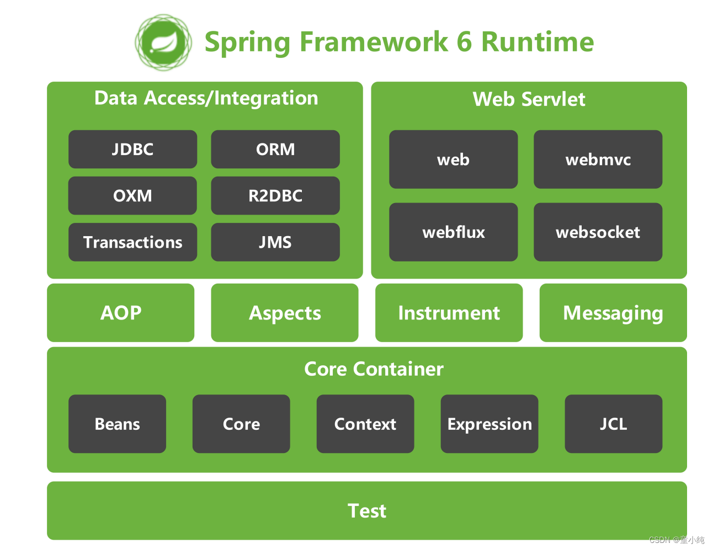

# SpringFramework介绍

## 1 Spring 和 SpringFramework 概念

**广义上的 Spring 泛指以 Spring Framework 为基础的 Spring 技术栈。**

经过十多年的发展，Spring 已经不再是一个单纯的应用框架，而是逐渐发展成为一个由多个不同子项目组成的成熟技术，例如 Spring Framework、Spring MVC、SpringBoot、Spring Cloud、Spring Data、Spring Security 等，其中 Spring Framework 是其他子项目的基础。

**狭义的 Spring 特指 Spring Framework，通常我们将它称为 Spring 框架。**

Spring Framework 是一个开源的应用程序框架，由SpringSource公司开发，最初是为了解决企业级开发中各种常见问题而创建的。它提供了很多功能，例如：依赖注入（DI）、面向切面编程（AOP）、声明式事务管理（TX）等。其主要目标是使企业级应用程序的开发变得更加简单和快速，并且Spring框架被广泛应用于Java企业开发领域。

::: tip

Spring全家桶的其他框架都是以SpringFramework框架为基础！

:::

## 2 SpringFramework 主要功能模块

SpringFramework框架结构图：

### Test

Spring 团队提倡测试驱动开发（TDD）。有了控制反转 (IoC)的帮助，单元测试和集成测试变得更简单。

- **spring-test**：Spring 的测试模块对 JUnit（单元测试框架）、TestNG（类似 JUnit）、Mockito（主要用来 Mock 对象）、PowerMock（解决 Mockito 的问题比如无法模拟 final，static， private 方法）等等常用的测试框架支持的都比较好。

### Core Container

Spring 框架的核心模块，也可以说是基础模块，Spring 其他所有的功能基本都需要依赖于该模块，主要提供 IoC 依赖注入功能的支持。

- **spring-core**：Spring 框架基本的核心工具类。
- **spring-beans**：提供对 bean 的创建、配置和管理等功能的支持。
- **spring-context**：提供对国际化、事件传播、资源加载等功能的支持。
- **spring-expression**：提供对表达式语言（Spring Expression Language） SpEL 的支持，只依赖于 core 模块，不依赖于其他模块，可以单独使用。
- **spring-jcl**：从Apache的commons-logging改造而来日志模块。

### AOP

- **spring-aspects**：该模块为与 AspectJ 的集成提供支持。
- **spring-aop**：提供了面向切面的编程实现。
- **spring-instrument**：提供了为 JVM 添加代理（agent）的功能。 具体来讲，它为 Tomcat 提供了一个织入代理，能够为 Tomcat 传递类文 件，就像这些文件是被类加载器加载的一样。

### Messaging

- **spring-messaging** 是从 Spring4.0 开始新加入的一个模块，主要职责是为 Spring 框架集成一些基础的报文传送应用。

### Data Access/Integration

- **spring-jdbc**：提供了对数据库访问的抽象 JDBC。不同的数据库都有自己独立的 API 用于操作数据库，而 Java 程序只需要和 JDBC API 交互，这样就屏蔽了数据库的影响。
- **spring-orm**：提供对 Hibernate、JPA、iBatis 等 ORM 框架的支持。
- **spring-oxm**：提供一个抽象层支撑 OXM(Object-to-XML-Mapping)，例如：JAXB、Castor、XMLBeans、JiBX 和 XStream 等。
- **spring-data-r2dbc**：Spring Data R2DBC项目是Spring Data家族的一部分，可轻松实现基于R2DBC的存储库。R2DBC（Reactive Relational Database Connectivity）是一个使用反应式驱动集成关系数据库的孵化器。Spring Data R2DBC运用熟悉的Spring抽象和repository 支持R2DBC。基于此，在响应式程序栈上使用关系数据访问技术，构建由Spring驱动的程序将变得非常简单。
- **spring-tx**：提供对事务的支持。
- **spring-jms** : 消息服务。自 Spring Framework 4.1 以后，它还提供了对 spring-messaging 模块的继承。

### Web Servlet

- **spring-web**：对 Web 功能的实现提供一些最基础的支持。
- **spring-webmvc**：提供对 Spring MVC 的实现。
- **spring-websocket**：提供了对 WebSocket 的支持，WebSocket 可以让客户端和服务端进行双向通信。
- **spring-webflux**：提供对 WebFlux 的支持。WebFlux 是 Spring Framework 5.0 中引入的新的响应式框架。与 Spring MVC 不同，它不需要 Servlet API，是完全异步。

## 3 SpringFramework主要优势

1. 丰富的生态系统：Spring生态系统非常丰富，支持许多模块和库，如Spring Boot、Spring Security、Spring Cloud等等，可以帮助开发人员快速构建高可靠性的企业应用程序。
2. 模块化的设计：框架组件之间的松散耦合和模块化设计使得Spring Framework具有良好的可重用性、可扩展性和可维护性。开发人员可以轻松地选择自己需要的模块，根据自己的需求进行开发。
3. 简化Java开发：Spring Framework简化了Java开发，提供了各种工具和APl，可以降低开发复杂度和学习成本。同时，Spring Framework支持各种应用场景，包括Web应用程序、RESTful API、消息传递、批处理等等。
4. 不断创新和发展：Spring Framework开发团队一直在不断创新和发展，保持与最新技术的接轨，为开发人员提供更加先进和优秀的工具和框架。