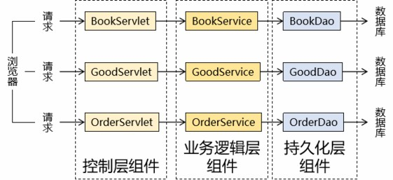
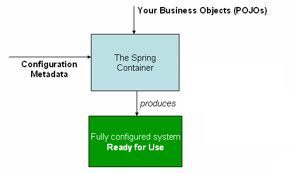
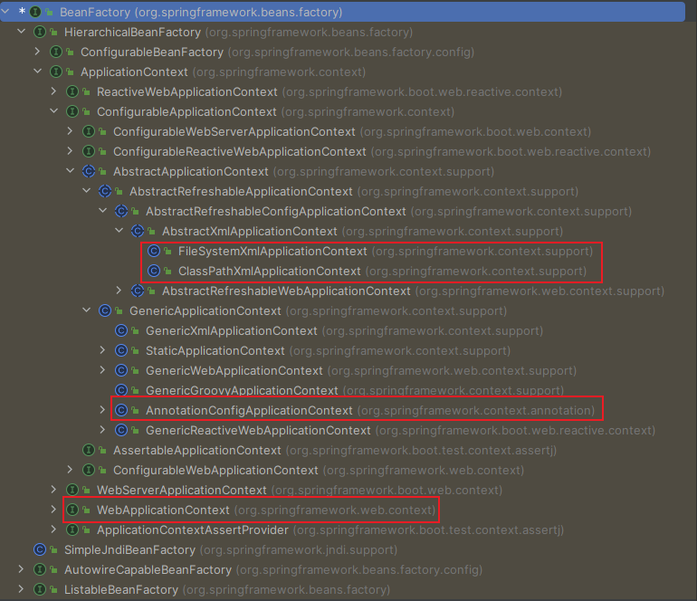

# Spring IoC容器核心概念
## 1 组件和组件管理概念

### 什么是组件？

常规的三层架构请求处理流程：

### 我们的期待

- 有人替我们创建组件的对象
- 有人帮我们保存组件的对象
- 有人帮助我们自动组装
- 有人替我们管理事务
- 有人协助我们整合其他框架
- ......

### Spring充当组件管理角色(IoC)

组件可以完全交给Spring框架进行管理，Spring框架替代了程序员原有的new对象和对象属性赋值动作等！

Spring具体的组件管理动作包含：

- 组件对象实例化
- 组件属性属性赋值
- 组件对象之间引用
- 组件对象存活周期管理
- ......

我们只需要编写配置文件告知Spring管理哪些类组件和他们的关系即可！

::: tip

注意：组件是映射到应用程序中所有可重用组件的Java对象，应该是可复用的功能对象！

- 组件一定是对象
- 对象不一定是组件

:::

### 组件交给Spring的管理优势！

1. **降低了组件之间的耦合性**：Spring loC容器通过依赖注入机制，将组件之间的依赖关系削弱，减少了程序组件之间的耦合性，使得组件更加松散地耦合。
2. **提高了代码的可重用性和可维护性**：将组件的实例化过程、依赖关系的管理等功能交给Spring loC容器处理，使得组件代码更加模块化、可重用、更易于维护。
3. **方便了配置和管理**：Spring loC容器通过XML文件或者注解，轻松的对组件进行配置和管理，使得组件的切换、替换等操作更加的方便和快捷。
4. 交给Spring管理的对象（组件），方可享受Spring框架的其他功能（AOP，声明事务管理）等。

## 2 Spring loC容器和容器实现

### 程序中的容器

普通容器：

- 数组
- 链表
- 集合
- ......

复杂容器：

- Servlet容器能够管理Servlet、Filter、Listener这样的组件的一生，所以它是一个复杂容器。

- Spring loC容器也是一个复杂容器。它们不仅要负责创建组件的对象、存储组件的对象，还要负责调用组件的方法让它们工作，最终在特定情况下销毁组件。

总结：Spring管理组件的容器，就是一个复杂容器，不仅存储组件，也可以管理组件之间依赖关系，并且创建和销毁组件等！

### Spring loC容器介绍

Spring loC容器，负责实例化、配置和组装bean(组件)。容器通过读取配置元数据来获取有关要实例化、配置和组装组件的指令。配置元数据以XML、Java注解或Java代码形式表现。它允许表达组成应用程序的组件以及这些组件之间丰富的相互依赖关系。

上图显示了Spring容器工作原理的高级视图。应用程序类与配置元数据相结合，您拥有完全配置且可执行的系统或应用程序。

### Spring IoC容器具体接口和实现类

Spring Ioc容器接口：

- BeanFactory：接口提供了一种高级配置机制，能够管理任何类型的对象，它是Spring Ioc容器标准超接口！
- ApplicationContext：是BeanFactory的子接口。它扩展了以下功能
  1. 更容易与Spring的AOP功能集成
  2. 消息资源处理（用于国际化）
  3. 特定于应用程序给予此接口实现，例如Web应用程序的WebApplicationContext

简而言之，BeanFactory提供了配置框架和基本功能，而ApplicationContext添加了更多特定于企业的功能。ApplicationContext是BeanFactory的完整超集。

ApplicationContext容器实现类：

| 类型名                             | 简介                                                         |
| ---------------------------------- | ------------------------------------------------------------ |
| FileSystemXmlApplicationContext    | 通过文件系统路径读取XML格式的配置文件，创建IoC容器对象       |
| ClassPathXmlApplicationContext     | 通过读取类路径下的XML格式的配置文件，创建IoC容器对象         |
| AnnotationConfigApplicationContext | 通过读取Java配置类，创建IoC容器对象                          |
| WebServerApplicationContext        | 为Web应用准备，基于Web环境创建IoC容器对象，并将对象存入ServletContext域中 |

### SpringloC容器管理配置方式

Spring loC容器使用多种形式的配置元数据。此配置元数据表示您作为应用程序开发人员如何告诉Spring容器实例化、配置和组装应用程序中的对象。

Spring框架提供了多种配置方式：

- **XML配置方式**

  是Spring框架最早的配置方式之一，通过在XML文件中定义Bean及其依赖关系、Bean的作用域等信息，让Spring loC容器来管理Bean之间的依赖关系。该方式从Spring框架的第一版开始提供支持。

- **注解方式**

  从Spring2.5版本开始提供支特，可以通过在Bean类上使用注解来代替XML配置文件中的配置信息。通过在Bean类上加上相应的注解（如@Component，@Service，@Autowired等），将Bean注册到Spring loC容器中，这样Spring loC容器就可以管理这些Bean之间的依赖关系。

- **Java配置类方式**

  从Spring3.0版本开始提供支持，通过Java类来定义Bean、Bean之间的依赖关系和配置信息，从而代替XML配置文件的方式。Java配置类是一种使用Jva编写配置信息的方式，通过@Configuration、@Bean等注解来实现Bean和依赖关系的配置。

## 3 Spring loC概念总结

### IoC容器

Spring loC容器，负责实例化、配置和组装bean(组件)核心容器。容器通过读取配置元数据来获取有关要实例化、配置和组装组件的指令。

### loC(Inversion of Control)控制反转

IoC主要是针对对象的创建和调用控制而言的，也就是说，当应用程序需要使用一个对象时，不再是应用程
序直接创建该对象，而是由oC容器来创建和管理，即控制权由应用程序转移到oC容器中，也就是“反转”了控制权。这种方式基本上是通过依赖查找的方式来实现的，即IoC容器维护着构成应用程序的对象，并负责创建这些对象。