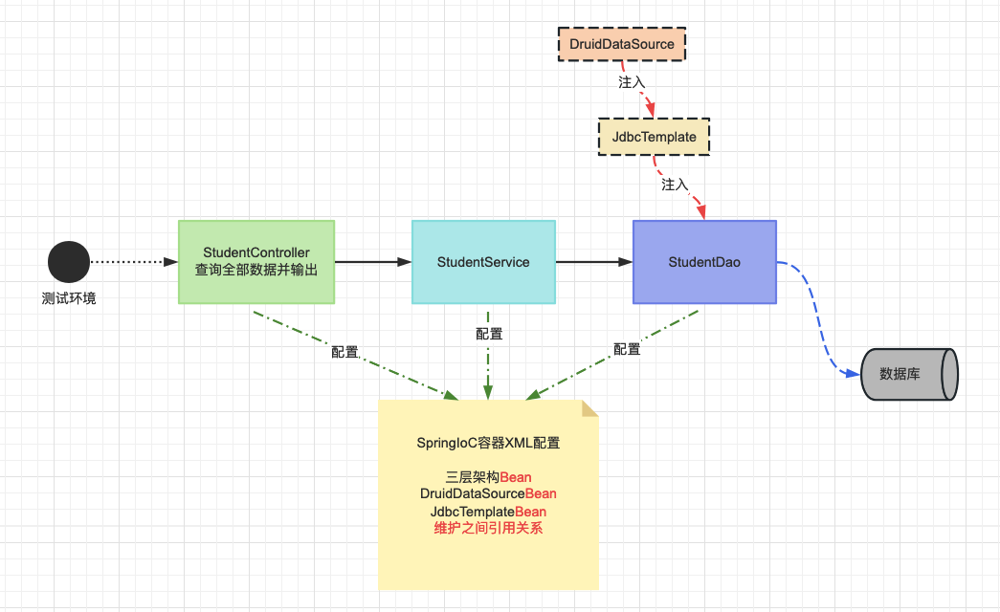

# 基于XML配置方式管理Bean

## 1 组件(Bean)信息声明配置(IoC)

1. 目标

   Spring IoC 容器管理一个或多个 bean。这些 Bean 是使用您提供给容器的配置元数据创建的（例如，以 XML `<bean/>` 定义的形式）。 我们学习，如何通过定义XML配置文件，声明组件类信息，交给 Spring 的 IoC 容器进行组件管理

2. 思路

   

3. 准备项目

   - 创建maven工程（spring-ioc-xml-01）

   - 导入SpringIoC相关依赖

     pom.xml

     ```xml
     <dependencies>
         <!--spring context依赖-->
         <!--当你引入Spring Context依赖之后，表示将Spring的基础依赖引入了-->
         <dependency>
             <groupId>org.springframework</groupId>
             <artifactId>spring-context</artifactId>
             <version>6.0.6</version>
         </dependency>
         <!--junit5测试-->
         <dependency>
             <groupId>org.junit.jupiter</groupId>
             <artifactId>junit-jupiter-api</artifactId>
             <version>5.3.1</version>
         </dependency>
     </dependencies>
     ```

### 基于无参构造函数

> 当通过构造函数方法创建一个 bean（组件对象） 时，所有普通类都可以由 Spring 使用并与之兼容。也就是说，正在开发的类不需要实现任何特定的接口或以特定的方式进行编码。只需指定 Bean 类信息就足够了。但是，默认情况下，我们需要一个默认（空）构造函数。

- 准备组件类

  ```java
  package com.haitang.ioc;
  
  public class HappyComponent {
      //默认包含无参数构造函数
      public void doWork() {
          System.out.println("HappyComponent.doWork");
      }
  }
  ```

- xml 配置文件编写

  resource/spring-bean-01.xml

  ```xml
  <!-- 基于无参数构造函数创建bean -->
  <bean id="happyComponent" class="com.atguigu.ioc.HappyComponent"/>
  ```

  - bean标签：通过配置bean标签告诉IOC容器需要创建对象的组件信息
  - id属性：bean的唯一标识，方便后期获取Bean!
  - class属性：组件类的全限定符！

  > 注意：要求当前组件类必须包含无参数构造函数！

### 基于静态工厂方法实例化

> 除了使用构造函数实例化对象，还有一类是通过工厂模式实例化对象。接下来我们讲解如何定义使用静态工厂方法创建Bean的配置 ！

- 准备组件类

  ```java
  public class ClientService {
      private static ClientService clientService = new ClientService();
  
      private ClientService() {
      }
  
      public static ClientService createInstance() {
          return clientService;
      }
  }
  ```

- xml 配置文件编写

  resource/spring-bean-01.xml

  ```xml
  <!-- 基于静态工厂方法实例化 -->
  <bean id="clientService" class="com.haitang.ioc.ClientService" factory-method="createInstance"/>
  ```

  - class属性：指定工厂类的全限定符！ 
  - factory-method: 指定静态工厂方法。

  > 注意：该方法必须是static方法。

### 基于实例工厂方法实例化

> 接下来我们讲解下如何定义使用实例工厂方法创建Bean的配置 ！

准备组件类

```java
// 实例类
public class ClientServiceImpl {
}
// 实例工厂类
public class DefaultServiceLocator {
    private static ClientServiceImpl clientService = new ClientServiceImpl();

    public ClientServiceImpl createClientServiceInstance() {
        return clientService;
    }
}
```

xml 配置文件编写

```xml
<!-- 基于实例工厂方法实例化 -->
<!-- 实例类 -->
<bean id="serviceLocator" class="com.haitang.ioc.DefaultServiceLocator"/>
<!-- 通过指定实例对象和工厂实例方法 -->
<bean id="clientServiceImpl" factory-bean="serviceLocator" factory-method="createClientServiceInstance"/>
```

- factory-bean属性：指定当前容器中工厂Bean 的名称。 
- factory-method: 指定实例工厂方法名。

> 注意：实例方法必须是非static的！

### 图解IoC配置流程


## 2 组件(Bean)依赖注入配置(Dl)

1. 目标

   通过配置文件，实现IoC容器中Bean之间的引用（依赖注入DI配置）。

   主要涉及注入场景：**基于构造函数的依赖注入和基于 Setter 的依赖注入**。

2. 思路

   

### 基于构造函数（单个构造参数）

- 介绍

  基于构造函数的 DI 是通过容器调用具有多个参数的构造函数来完成的，每个参数表示一个依赖项。 下面的示例演示一个只能通过构造函数注入进行依赖项注入的类！

- 准备组件类

  ```java
  // dao类
  public class UserDao {
  }
  // service类
  public class UserService {
  
      private UserDao userDao;
  
      public UserService(UserDao userDao) {
          this.userDao = userDao;
      }
  }
  ```

- 编写配置文件

  resources/spring-di-02.xml

  ```xml
  <beans>
      <!-- 引用类bean声明 -->
      <bean id="userService" class="com.haitang.di.UserService">
          <!-- 构造函数引用 -->
          <constructor-arg ref="userDao"/>
      </bean>
      <!-- 被引用类bean声明 -->
      <bean id="userDao" class="com.haitang.di.UserDao"/>
  </beans>
  ```

  - constructor-arg标签：可以引用构造参数 ref 引用其他bean的标识。

### 基于构造函数（多构造参数解析）

- 介绍

  基于构造函数的 DI 是通过容器调用具有多个参数的构造函数来完成的，每个参数表示一个依赖项。 下面的示例演示通过构造函数注入多个参数，参数包含其他bean和基本数据类型！

- 准备组件类

  ```java
  // dao类
  public class UserDao {
  }
  // service类
  public class UserService {
  
      private UserDao userDao;
  
      private int age;
  
      private String name;
  
      public UserService(int age, String name, UserDao userDao) {
          this.userDao = userDao;
          this.age = age;
          this.name = name;
      }
  }
  ```

- 编写配置文件

  ```xml
  <!-- 场景1: 多参数，可以按照相应构造函数的顺序注入数据 -->
  <bean id="userService" class="com.haitang.di.UserService">
      <!-- value直接注入基本类型值 -->
      <constructor-arg value="18"/>
      <constructor-arg value="赵伟风"/>
      <constructor-arg ref="userDao"/>
  </bean>
  <!-- 被引用类bean声明 -->
  <bean id="userDao" class="com.haitang.di.UserDao"/>
  ```

  ```xml
  <!-- 场景2: 多参数，可以按照相应构造函数的名称注入数据 -->
  <bean id="userService" class="com.haitang.di.UserService">
      <!-- value直接注入基本类型值 -->
      <constructor-arg name="name" value="赵伟风"/>
      <constructor-arg name="userDao" ref="userDao"/>
      <constructor-arg name="age" value="18"/>
  </bean>
  <!-- 被引用类bean声明 -->
  <bean id="userDao" class="com.haitang.di.UserDao"/>
  ```

  ```xml
  <!-- 场景3: 多参数，可以按照相应构造函数的角标注入数据。index从0开始 构造函数(0,1,2....) -->
  <bean id="userService" class="com.haitang.di.UserService">
      <!-- value直接注入基本类型值 -->
      <constructor-arg index="1" value="赵伟风"/>
      <constructor-arg index="2" ref="userDao"/>
      <constructor-arg index="0" value="18"/>
  </bean>
  <!-- 被引用类bean声明 -->
  <bean id="userDao" class="com.haitang.di.UserDao"/>
  ```

  - constructor-arg标签：指定构造参数和对应的值。
    1. name属性指定参数名
    2. index属性指定参数角标
    3. value属性指定普通属性值

### 基于Setter方法依赖注入

- 介绍

  开发中，除了构造函数注入（DI）更多的使用的Setter方法进行注入！

  下面的示例演示一个只能使用纯 setter 注入进行依赖项注入的类。

- 准备组件类

  ```java
  package com.haitang.setter;
  
  public class MovieFinder {
  }
  
  public class SimpleMovieLister {
  
      private MovieFinder movieFinder;
  
      private String movieName;
  
      public void setMovieFinder(MovieFinder movieFinder) {
          this.movieFinder = movieFinder;
      }
  
      public void setMovieName(String movieName) {
          this.movieName = movieName;
      }
  }
  ```

- 编写配置文件

  ```xml
  <bean id="simpleMovieLister" class="com.haitang.setter.SimpleMovieLister">
      <!-- setter方法，注入movieFinder对象的标识id
           name = 属性名  ref = 引用bean的id值
       -->
      <property name="movieFinder" ref="movieFinder"/>
      <!-- setter方法，注入基本数据类型movieName
           name = 属性名 value= 基本类型值
       -->
      <property name="movieName" value="消失的她"/>
  </bean>
  <bean id="movieFinder" class="com.haitang.setter.MovieFinder"/>
  ```

  - property标签： 可以给setter方法对应的属性赋值。
    1. name属性代表set方法标识
    2. ref代表引用bean的标识id
    3. value属性代表基本属性值

### 总结

依赖注入（DI）包含引用类型和基本数据类型，同时注入的方式也有多种！主流的注入方式为setter方法注入和构造函数注入，两种注入语法都需要掌握！ 

> 需要特别注意：引用其他bean，使用ref属性。直接注入基本类型值，使用value属性。

## 3 IoC容器创建和使用

1. 介绍

   上面的实验只是讲解了如何在XML格式的配置文件编写IoC和DI配置！

   

   想要配置文件中声明组件类信息真正的进行实例化成Bean对象和形成Bean之间的引用关系，我们需要声明IoC容器对象，读取配置文件，实例化组件和关系维护的过程都是在IoC容器中实现的！

2. 容器实例化

   ```java
   //方式1:实例化并且指定配置文件
   //参数：传入一个或者多个配置文件
   ClassPathXmlApplicationContext context = new ClassPathXmlApplicationContext("services.xml", "daos.xml");
   
   //方式2:先实例化，再指定配置文件，最后刷新容器触发Bean实例化动作
   ClassPathXmlApplicationContext context = new ClassPathXmlApplicationContext();
   //设置配置配置文件,方法参数为可变参数,可以设置一个或者多个配置
   context.setConfigLocations("services.xml", "daos.xml");
   //后配置的文件,需要调用refresh方法,触发刷新配置
   context.refresh();
   ```

3. Bean对象读取

   ```java
   //方式1: 根据bean的id获取
   //没有指定类型,返回为Object,需要类型转化!
   Object happyComponent = context.getBean("happyComponent");
   HappyComponent happyComponent = (HappyComponent) context.getBean("happyComponent");
   
   //方式2: 根据bean的类型获取
   //根据bean的类型获取,但是要求,同类型(当前类,或者子类,或者接口的实现类)只能有一个对象交给IoC容器管理
   //配置两个或者以上出现: org.springframework.beans.factory.NoUniqueBeanDefinitionException 问题
   HappyComponent happyComponent = context.getBean(HappyComponent.class);
   
   //方式3: 根据bean的id和类型获取
   HappyComponent happyComponent = context.getBean("happyComponent", HappyComponent.class);
   ```

## 4 组件(Bean)作用域和周期方法配置

### 组件周期方法配置

周期方法概念：

我们可以在组件类中定义方法，然后当IoC容器实例化和销毁组件对象的时候进行调用！这两个方法我们成为生命周期方法！ 类似于Servlet的init/destroy方法，我们可以在周期方法完成初始化和释放资源等工作。

周期方法声明：

```java
public class JavaBean {
    public void init() {
        // 初始化逻辑
    }

    public void destroy() {
        // 释放资源逻辑
    }
}
```

周期方法配置：

```xml
<bean id="javaBean" class="com.haitang.bean.JavaBean" init-method="init" destroy-method="destroy"/>
```

### 组件作用域配置

Bean作用域概念：

`<bean>` 标签声明Bean，只是将Bean的信息配置给SpringIoC容器！

在IoC容器中，这些`<bean>`标签对应的信息转成Spring内部 `BeanDefinition` 对象，`BeanDefinition` 对象内，包含定义的信息（id，class，属性等等）！

这意味着，`BeanDefinition`与类概念一样，SpringIoC容器可以可以根据`BeanDefinition`对象反射创建多个Bean对象实例。 具体创建多少个Bean的实例对象，由Bean的作用域Scope属性指定！

作用域可选值：

| 取值      | 含义                                | 创建对象的时机 | 默认值 |
| --------- | ----------------------------------- | -------------- | ------ |
| singleton | 在IoC容器中，bean的对象始终为单实例 | IoC容器初始化  | 是     |
| prototype | 这个bean在IoC容器中有多个实例       | 获取bean时     | 否     |

如果是在`WebApplicationContext`环境下还会有另外两个作用域

| 取值    | 含义                 | 创建对象的时机 | 默认值 |
| ------- | -------------------- | -------------- | ------ |
| request | 请求范围内有效的实例 | 每次请求       | 否     |
| session | 会话范围内有效的实例 | 每次会话       | 否     |

作用域配置：

```xml
<!-- scope属性：取值singleton（默认值），bean在IOC容器中只有一个实例，IOC容器初始化时创建对象 --> 
<bean id="javaBean" class="com.haitang.bean.JavaBean" scope="singleton"/>
<!-- scope属性：取值prototype，bean在IOC容器中可以有多个实例，getBean()时创建对象 -->
<bean id="javaBean" class="com.haitang.bean.JavaBean" scope="prototype"/>
```

## 5 FactoryBean特性和使用

### FactoryBean简介

FactoryBean 接口是Spring IoC容器实例化逻辑的可插拔性点。

用于配置复杂的Bean对象，可以将创建过程存储在FactoryBean 的 getObject方法！

`FactoryBean<T>` 接口提供三种方法：

- T getObject()：返回此工厂创建的对象的实例。该返回值会被存储到IoC容器！
- boolean isSingleton()：如果此 FactoryBean 返回单例，则返回 true ，否则返回 false 。此方法的默认实现返回 true （注意，lombok插件使用，可能影响效果）。
- Class getObjectType()：返回 getObject() 方法返回的对象类型，如果事先不知道类型，则返回 null 。


### FactoryBean使用场景

- 代理类的创建
- 第三方框架整合
- 复杂对象实例化等

### Factorybean应用

JavaBean类

```java
public class JavaBean {
    private String name;

    public String getName() {
        return name;
    }

    public void setName(String name) {
        this.name = name;
    }
}
```

FactoryBean类

```java
public class JavaBeanFactoryBean implements FactoryBean<JavaBean> {

    @Override
    public JavaBean getObject() throws Exception {
        // 自定义JavaBean实例化
        return new JavaBean();
    }

    @Override
    public Class<?> getObjectType() {
        return JavaBean.class;
    }
}
```

配置FactoryBean类

```xml
<!-- id getObject方法返回的对象标识;class factoryBean标准化工厂类 -->
<bean id="javaBean" class="com.haitang.bean.JavaBeanFactoryBean"/>
```

### FactoryBean和BeanFactory区别

- FactoryBean 是 Spring 中一种特殊的 bean，可以在 getObject() 工厂方法自定义的逻辑创建Bean！是一种能够生产其他 Bean 的 Bean。FactoryBean 在容器启动时被创建，而在实际使用时则是通过调用 getObject() 方法来得到其所生产的 Bean。因此，FactoryBean 可以自定义任何所需的初始化逻辑，生产出一些定制化的 bean。

   一般情况下，整合第三方框架，都是通过定义FactoryBean实现！！！

- BeanFactory 是 Spring 框架的基础，其作为一个顶级接口定义了容器的基本行为，例如管理 bean 的生命周期、配置文件的加载和解析、bean 的装配和依赖注入等。BeanFactory 接口提供了访问 bean 的方式，例如 getBean() 方法获取指定的 bean 实例。它可以从不同的来源（例如 Mysql 数据库、XML 文件、Java 配置类等）获取 bean 定义，并将其转换为 bean 实例。同时，BeanFactory 还包含很多子类（例如，ApplicationContext 接口）提供了额外的强大功能。

总的来说，FactoryBean 和 BeanFactory 的区别主要在于前者是用于创建 bean 的接口，它提供了更加灵活的初始化定制功能，而后者是用于管理 bean 的框架基础接口，提供了基本的容器功能和 bean 生命周期管理。

## 6 基于XML方式整合三层架构组件

1. 需求分析

   搭建一个三层架构案例，模拟查询全部学生（学生表）信息，持久层使用JdbcTemplate和Druid技术，使用XML方式进行组件管理！

   

2. 数据库准备

   ```sql
   create database studb;
   
   use studb;
   
   CREATE TABLE students (
     id INT PRIMARY KEY,
     name VARCHAR(50) NOT NULL,
     gender VARCHAR(10) NOT NULL,
     age INT,
     class VARCHAR(50)
   );
   
   INSERT INTO students (id, name, gender, age, class)
   VALUES
     (1, '张三', '男', 20, '高中一班'),
     (2, '李四', '男', 19, '高中二班'),
     (3, '王五', '女', 18, '高中一班'),
     (4, '赵六', '女', 20, '高中三班'),
     (5, '刘七', '男', 19, '高中二班'),
     (6, '陈八', '女', 18, '高中一班'),
     (7, '杨九', '男', 20, '高中三班'),
     (8, '吴十', '男', 19, '高中二班');
   ```

3. 项目准备

   - 项目创建

     spring-xml-practice-02

   - 依赖导入

     ```xml
     <dependencies>
           <!--spring context依赖-->
           <!--当你引入SpringContext依赖之后，表示将Spring的基础依赖引入了-->
           <dependency>
               <groupId>org.springframework</groupId>
               <artifactId>spring-context</artifactId>
               <version>6.0.6</version>
           </dependency>
     
           <!-- 数据库驱动和连接池-->
           <dependency>
               <groupId>mysql</groupId>
               <artifactId>mysql-connector-java</artifactId>
               <version>8.0.25</version>
           </dependency>
     
           <dependency>
               <groupId>com.alibaba</groupId>
               <artifactId>druid</artifactId>
               <version>1.2.8</version>
           </dependency>
     
           <!-- spring-jdbc -->
           <dependency>
               <groupId>org.springframework</groupId>
               <artifactId>spring-jdbc</artifactId>
               <version>6.0.6</version>
           </dependency>
           <dependency>
          	  <groupId>org.projectlombok</groupId>
         	  <artifactId>lombok</artifactId>
         	  <version>1.18.30</version>
     	  </dependency>
     </dependencies> 
     ```

   - 实体类

     ```java
     @Data
     public class Student {
         private Integer id;
         private String name;
         private String gender;
         private Integer age;
         private String classes;
     }
     ```

4. JdbcTemplate技术讲解

   为了在特定领域帮助我们简化代码， Spring 封装了很多 『Template』形式的模板类。例如：RedisTemplate、RestTemplate 等等，包括我们今天要学习的 JdbcTemplate。

   - jdbc配置文件

     ```properties
     haitang.url=jdbc:mysql://localhost:3306/studb
     haitang.driver=com.mysql.cj.jdbc.Driver
     haitang.username=root
     haitang.password=root
     ```

   - spring配置文件

     ```xml
     <?xml version="1.0" encoding="UTF-8"?>
     <beans xmlns="http://www.springframework.org/schema/beans"
            xmlns:xsi="http://www.w3.org/2001/XMLSchema-instance"
            xmlns:context="http://www.springframework.org/schema/context"
            xsi:schemaLocation="http://www.springframework.org/schema/beans
            http://www.springframework.org/schema/beans/spring-beans.xsd
            http://www.springframework.org/schema/context
            https://www.springframework.org/schema/context/spring-context.xsd">
     
         <!--导入外部文件-->
         <context:property-placeholder location="classpath:jdbc.properties"/>
     
         <!--配置数据源-->
         <bean id="druidDataSource" class="com.alibaba.druid.pool.DruidDataSource">
             <property name="url" value="${haitang.url}"/>
             <property name="driverClassName" value="${haitang.driver}"/>
             <property name="username" value="${haitang.username}"/>
             <property name="password" value="${haitang.password}"/>
         </bean>
     
         <!--配置jdbcTemplate-->
         <bean id="jdbcTemplate" class="org.springframework.jdbc.core.JdbcTemplate">
             <!--装配数据源-->
             <property name="dataSource" ref="druidDataSource"/>
         </bean>
     </beans>
     ```

5. 三层架构搭建和实现

   持久层

   ```java
   //接口
   public interface StudentDao {
   
       /**
        * 查询全部学生数据
        * @return
        */
       List<Student> queryAll();
   }
   
   //实现类
   public class StudentDaoImpl implements StudentDao {
   
       private JdbcTemplate jdbcTemplate;
   
       public void setJdbcTemplate(JdbcTemplate jdbcTemplate) {
           this.jdbcTemplate = jdbcTemplate;
       }
   
       /**
        * 查询全部学生数据
        * @return
        */
       @Override
       public List<Student> queryAll() {
   
           String sql = "select id , name , age , gender , class as classes from students ;";
   
           /*
             query可以返回集合!
             BeanPropertyRowMapper就是封装好RowMapper的实现,要求属性名和列名相同即可
            */
           List<Student> studentList = jdbcTemplate.query(sql, new BeanPropertyRowMapper<>(Student.class));
   
           return studentList;
      }
   }
   
   ```

   业务层

   ```java
   //接口
   public interface StudentService {
   
       /**
        * 查询全部学员业务
        * @return
        */
       List<Student> findAll();
   
   }
   
   //实现类
   public class StudentServiceImpl  implements StudentService {
       
       private StudentDao studentDao;
   
       public void setStudentDao(StudentDao studentDao) {
           this.studentDao = studentDao;
       }
   
       /**
        * 查询全部学员业务
        * @return
        */
       @Override
       public List<Student> findAll() {
           
           List<Student> studentList =  studentDao.queryAll();
           
           return studentList;
       }
   }
   ```

   表述层

   ```java
   public class StudentController {
       
       private StudentService studentService;
   
       public void setStudentService(StudentService studentService) {
           this.studentService = studentService;
       }
       
       public void  findAll(){
          List<Student> studentList =  studentService.findAll();
           System.out.println("studentList = " + studentList);
       }
   }
   ```

6. 三层架构IoC配置

   ```xml
   <bean id="studentDao" class="com.haitang.dao.impl.StudentDaoImpl">
       <property name="jdbcTemplate" ref="jdbcTemplate"/>
   </bean>
   <bean id="studentService" class="com.haitang.service.impl.StudentServiceImpl">
       <property name="studentDao" ref="studentDao"/>
   </bean>
   <bean id="studentController" class="com.haitang.controller.StudentController">
       <property name="studentService" ref="studentService"/>
   </bean>
   ```

7. 运行测试

   ```java
   public class ControllerTest {
   
       @Test
       public void testRun() {
           ApplicationContext applicationContext =
                   new ClassPathXmlApplicationContext("spring.xml");
           StudentController studentController = applicationContext.getBean(StudentController.class);
           studentController.findAll();
       }
   }
   ```

8. XMLIoC方式问题总结

   - 注入的属性必须添加setter方法、代码结构乱！
   - 配置文件和Java代码分离、编写不是很方便！
   - XML配置文件解析效率低

